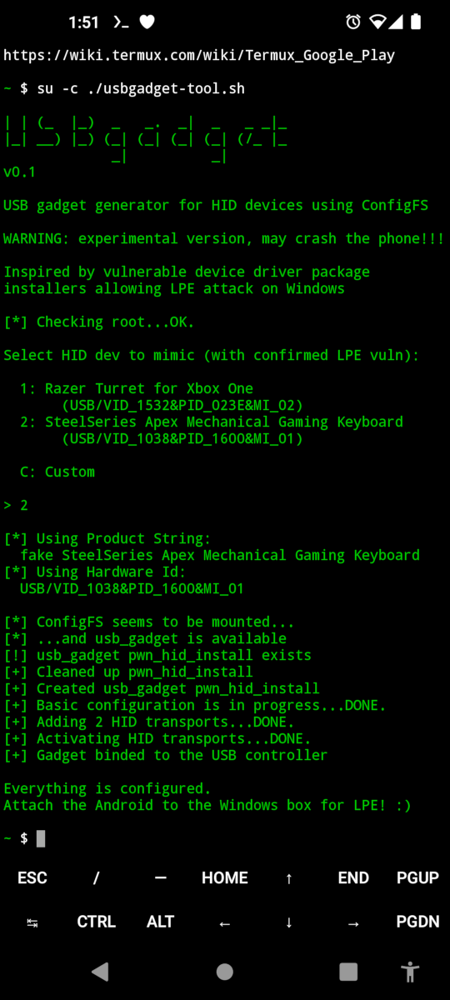

# USB Gadget Generator Tool

Mini Tool for generating USB gadget HID devices on Android phone using
the ConfigFS interface.

Tested on LineageOS 18.1.

Purpose: exploiting Local Privilege Escalation on Windows using vulnerable
USB device driver install from Windows Update **without using the
genuine USB devices.**

That is: **Local Privilege Escalation using a USB attached Android phone.**

